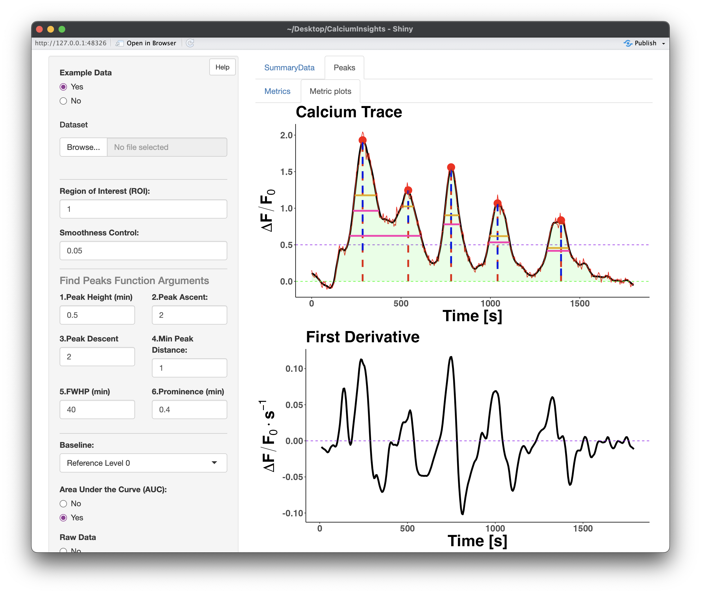

# CalciumInsights

**CalciumInsights** is an interactive application built in **R/Shiny** for the analysis, visualization, denoising, and quantification of calcium transient signals.

The application provides tools to explore calcium traces, apply signal denoising methods, detect calcium transients, extract quantitative metrics, and export results for further analysis or reporting.



---

## Main Features

CalciumInsights allows users to:

- Upload calcium signal datasets.
- Use an example dataset included with the application.
- Select a specific region of interest (ROI) for analysis.
- Apply FFT-based denoising to calcium traces.
- Detect calcium transient peaks using user-defined parameters.
- Estimate calcium transient metrics, including amplitude, prominence, rise time, FWHP, FWHM, and AUC.
- Visualize raw and denoised traces.
- Explore Fourier-based signal reconstruction and frequency-domain summaries.
- Download trace metrics, transient metrics, and calcium trace graphs.

---

## Installation Requirements

Before installing CalciumInsights from GitHub, make sure the following programs are installed on your computer:

### 1. R

Download and install R from:

<https://cran.r-project.org/>

### 2. RStudio

Download and install RStudio Desktop from:

<https://posit.co/download/rstudio-desktop/>

### 3. Git

Git is recommended for installing the application directly from GitHub.

Download and install Git from:

<https://git-scm.com/downloads>

To check whether Git is already installed, open the terminal and run:

```bash
git --version
```

---

## Required R Packages

The following R packages are required by CalciumInsights:

```r
install.packages(c(
  "remotes",
  "config",
  "golem",
  "shiny",
  "shinydashboard",
  "shinyjs",
  "ggplot2",
  "DT",
  "gridExtra",
  "pracma",
  "tidyverse",
  "dplyr",
  "reshape2",
  "refund",
  "fda",
  "fds",
  "latex2exp",
  "plotly",
  "magrittr",
  "png",
  "prospectr",
  "vroom",
  "jsonlite"
))
```

> Note: If the `DESCRIPTION` file of the package is correctly configured, most dependencies will be installed automatically when installing the app from GitHub.

---

## Installing CalciumInsights from GitHub

The following command only needs to be run the first time you install the app:

```r
install.packages("remotes")
```

Then install CalciumInsights directly from GitHub:

```r
remotes::install_github("AOG-Lab/CalciumInsights")
```

---

## Running the Application

After installation, load the package and run the app:

```r
library(CalciumInsights)

run_app()
```

The application will open locally in your default web browser or in the RStudio Viewer pane.

---

## Basic Workflow

A typical CalciumInsights workflow is:

1. Open the application using `run_app()`.
2. Upload your calcium signal dataset or use the example data.
3. Select the region of interest to analyze.
4. Adjust the FFT denoising and peak detection parameters.
5. Review the calcium trace, detected peaks, and metric plots.
6. Download the resulting metrics and figures.

---

## Input Data Format

The input dataset should contain a time column followed by one or more calcium signal columns corresponding to different regions of interest.

Example structure:

| Time | ROI_1 | ROI_2 | ROI_3 |
|------|-------|-------|-------|
| 0.0  | 0.15  | 0.21  | 0.18  |
| 0.5  | 0.18  | 0.25  | 0.20  |
| 1.0  | 0.22  | 0.28  | 0.24  |

The first column should represent time, and the remaining columns should represent calcium traces for each ROI.

---

## Output Files

CalciumInsights allows users to download:

- Trace-level metrics.
- Transient-level metrics.
- Calcium trace graphs.
- Tables summarizing detected peaks and signal characteristics.

---

## Notes

The current version of CalciumInsights focuses on FFT-based denoising and calcium transient analysis. The app is designed to support interactive exploration of calcium signals and facilitate reproducible quantitative analysis.

---

## Citation

If you use CalciumInsights in your research, please cite the application or related manuscript when available.

---

## Authors

Developed by Deiver Suárez, Norma Pérez, Gabriel Miranda, and Santiago Colom.

Repository:

<https://github.com/AOG-Lab/CalciumInsights>


